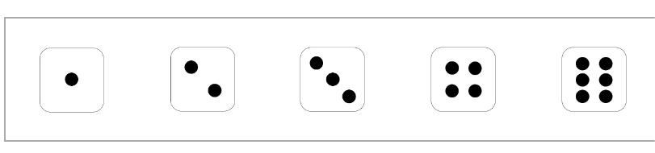

# 游戏规则
## 游戏流程
`双击打开index.html`，进入游戏，`选择游戏模式，设置游戏局数和玩家个人筹码数`

每一局游戏内有三轮投掷机会，玩家`一人一次轮流投掷骰子`，每个玩家有5个骰子。

前两次投掷骰子之后可以选择锁定0~5个骰子，`锁定的骰子位于选定区域不再改变。`

前两轮每轮投掷结束并在所有玩家锁定骰子后，每位玩家可以选择增加倍率：0，1，2，3。`先锁定骰子后，等待全部玩家锁定才进行倍率选择。`选择完成后进入下一轮。

第三轮投掷结束后，所有玩家的全部骰子自动锁定并进行计分（得分为五个骰子的点数总和+奖励分），`展示赢家的骰子`，筹码划分。
## 奖励分示例
* 双对 ：10分

* 三连 ：10分

* 葫芦：20分

* 四连： 40分

* 五连 ：100分

* 小顺子：30分

* 大顺子：60分

## 结算规则

分数最高的玩家从所有其它玩家手里赢得（二人分差的绝对值）*（总倍率）的筹码。

N局游戏后，筹码最多的玩家获胜。

如若中途有玩家筹码小于等于0，则该玩家被击飞，游戏直接结束.
